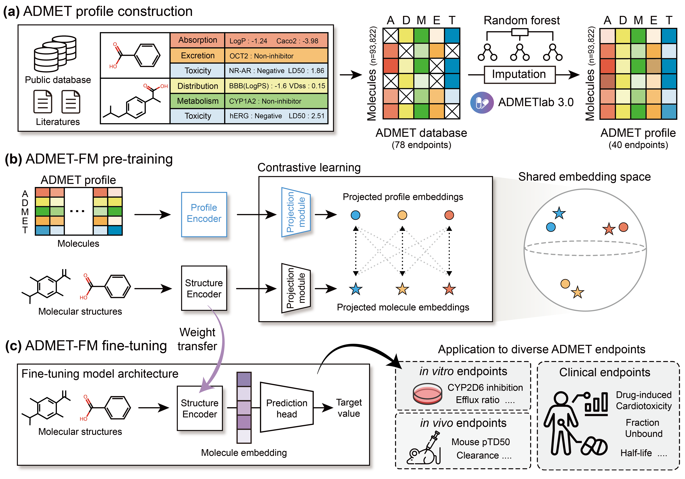

# ADMET-FM

## Information

This repository provides the code, datasets, and pre-trained weights for ADMET-FM.
It includes a Jupyter notebook for pre-training and Python scripts for
classification and regression fine-tuning.

- **Purpose:** Molecular representation learning for accurate and generalizable ADMET property prediction.
- **Pre-training:** ADMET-FM employs ChemBERTa-2 (`DeepChem/ChemBERTa-77M-MTR`) as its backbone architecture and learns molecular representations by integrating molecular structure and ADMET profile information.
- **Downstream Applications:** Fine-tuning the pre-trained model for diverse ADMET classification and regression tasks.

### Overview
<p align="center">
  
</p>

Contact Info:

15pms@gm.gist.ac.kr

hojungnam@yonsei.ac.kr


<br />

## Environment setup (uv)

This project requires Python 3.10 or later and uses
[uv](https://docs.astral.sh/uv/) for environment and dependency management.

From the repository root, create the environment and install the locked
dependencies:

```bash
uv sync
```

To use the project environment as a Jupyter kernel:

```bash
uv run python -m ipykernel install --user --name admet-fm --display-name "ADMET-FM"
```

<br />

## Repository structure

- `pretraining_data/`: Training, validation, and test datasets used for
  pre-training.
- `finetuning_data/Classification/`: Classification datasets. Each task must
  contain `train.csv`, `valid.csv`, and `test.csv`.
- `finetuning_data/Regression/`: Regression datasets. Each task must contain
  `train.csv`, `valid.csv`, and `test.csv`.
- `pre_trained_weights/`: Pre-trained model weights used by the fine-tuning
  scripts.
- `Pre-training.ipynb`: Jupyter notebook for model pre-training and evaluation.
- `finetuning_cls.py`: Fine-tuning script for classification tasks.
- `finetuning_reg.py`: Fine-tuning script for regression tasks.

<br />

## Pre-training

During pre-training, ADMET-FM learns molecular representations by jointly leveraging molecular structure and ADMET profile information. The provided notebook reproduces the pre-training workflow, including data loading, model training, validation, and checkpoint selection.

Start Jupyter from the repository root:

Open `Pre-training.ipynb`, select the `ADMET-FM` kernel, and run the cells in
order. The notebook reads the three CSV files in `pretraining_data/`, trains the
model, and writes the best model state to `pre_trained_weights/`.

The notebook currently selects `cuda:0`; edit the device cell if a different
GPU or CPU should be used.

<br />

## Fine-tuning

The pre-trained ADMET-FM model can be adapted to downstream molecular property prediction tasks through supervised fine-tuning. Separate scripts are provided for binary classification and regression tasks.

Fine-tuning uses `pre_trained_weights/pt_weights.pth`. Place each dataset under
the appropriate task directory:

```text
finetuning_data/
|-- Classification/<TASK_NAME>/
|   |-- train.csv
|   |-- valid.csv
|   `-- test.csv
`-- Regression/<TASK_NAME>/
    |-- train.csv
    |-- valid.csv
    `-- test.csv
```

Each CSV file must contain a `smiles` column and the target column specified by
`--col_name`.

### Access to the Full Fine-tuning Datasets
Due to repository size limitations, only example datasets are currently provided in `finetuning_data/`. The complete fine-tuning datasets will be made publicly available once the external files are ready for public release.

In the meantime, if you need access to the full datasets used in our experiments, please contact us using the email addresses provided in the **Contact Info** section.

### Classification

Edit the placeholders before running:

```bash
uv run python finetuning_cls.py \
  --task_name <CLASSIFICATION_TASK_DIRECTORY> \
  --col_name <TARGET_COLUMN> \
  --gpu_id <GPU_ID> \
  --batch_size <BATCH_SIZE> \
  --n_epochs <NUMBER_OF_EPOCHS> \
  --random_seed <RANDOM_SEED> \
  --lr <LEARNING_RATE>
```

To implement the example code for fine-tuning classification task run the following command
> uv run python finetuning_cls.py --task_name=CYP2B6_Inhibitor

### Regression

Edit the placeholders before running:

```bash
uv run python finetuning_reg.py \
  --task_name <REGRESSION_TASK_DIRECTORY> \
  --col_name <TARGET_COLUMN> \
  --gpu_id <GPU_ID> \
  --batch_size <BATCH_SIZE> \
  --n_epochs <NUMBER_OF_EPOCHS> \
  --random_seed <RANDOM_SEED> \
  --lr <LEARNING_RATE>
```

To implement the example code for fine-tuning regression task run the following command
> uv run python finetuning_reg.py --task_name=Fraction_unbound

Set `--gpu_id` to `-1` to run fine-tuning on CPU.

